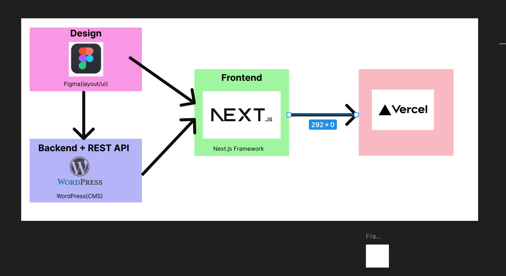
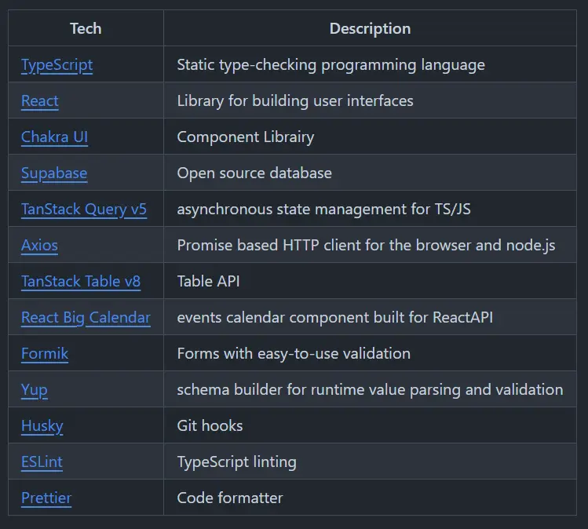

# Zeliwne

## Opis projektu

### [POL]
Zeliwne jest to projekt aplikacji internetowej, gdzie frontend został wykonany we frameworku Next.js, a za backend z bazą danych odpowiada WordPress. Klient w panelu administracyjnym WordPressa może modyfikować i wprowadzać dowolne zmiany tekstu i grafik. Struktura graficzna projektu po konsultacjach z klientem została wykonana w Figmie. Docelowo projekt został udostępniony na Vercelu.

### [ENG]
Zeliwne is a web application project where the frontend is built using the Next.js framework, and the backend, along with the database, is powered by WordPress. The client can use the WordPress admin panel to modify and make any changes to the text and graphics. The graphical structure of the project, developed after consultations with the client, was designed in Figma. Ultimately, the project was deployed on Vercel.





## Wymagania wstępne / Prerequisites

- **Node.js**: 18.17.0 (Zalecana: 22)
- **Git**: Wersja >2
- **Edytor kodu**: np. Visual Studio Code




### Instalacja

1. Sklonuj repozytorium:
   ```bash
   git clone https://github.com/takimi12/Final-Zelwine
   ```
2. Zainstaluj zależności:
   ```bash
   npm install
   ```
3. Uruchom aplikację w trybie deweloperskim:
   ```bash
   npm run dev
   ```

---

## Skrypty

### dev: `next dev`
- Uruchamia aplikację w trybie deweloperskim.
- Funkcje:
  - Serwer deweloperski.
  - Automatyczne odświeżanie strony po zmianach w kodzie.
  - Idealny do aktywnego rozwijania projektu.

### build: `next build`
- Kompiluje aplikację do wersji produkcyjnej.
- Funkcje:
  - Optymalizacja kodu (np. redukcja rozmiaru, minifikacja).
  - Generowanie statycznych plików HTML i innych zasobów.
  - Przygotowanie do wdrożenia na serwer produkcyjny.

### start: `next start`
- Uruchamia aplikację w trybie produkcyjnym przy użyciu wcześniej skompilowanej wersji.
- Używany po wdrożeniu aplikacji na serwerze produkcyjnym.

### lint: `next lint`
- Sprawdza kod za pomocą narzędzia ESLint w celu wykrycia i naprawy potencjalnych błędów.
- Funkcje:
  - Analiza zgodności ze standardami kodowania.

### format: `prettier --write .`
- Formatuje kod przy użyciu narzędzia Prettier.
- Funkcje:
  - Zachowanie spójnego stylu kodowania w projekcie.

---

## Link do wersji live

Link do aplikacji zostanie podany po poprawieniu endpointów WordPressa i plików `.t`.

---

## Architektura projektu

### Backend
- Backend został napisany w oparciu o WooCommerce.
- Treści wyświetlane na stronie pochodzą z endpointów API WordPressa.

### Frontend
- Architektura aplikacji Next.js odzwierciedla flow stworzone przez autora backendu, co zapewnia intuicyjność i szybkość obsługi pod kątem wprowadzania danych.

### Rozszerzalność
- Struktura CMS WordPress została zaprojektowana tak, aby w przyszłości można było łatwo przekształcić aplikację w sklep internetowy.

---

## Kontakt do autora

- GitHub: [takimi12](https://github.com/takimi12)
- LinkedIn: [Tomasz Olech](https://www.linkedin.com/in/tomasz-olech-136b9a13a/)
- E-mail: [tomek12olech@gmail.com](mailto:tomek12olech@gmail.com)
