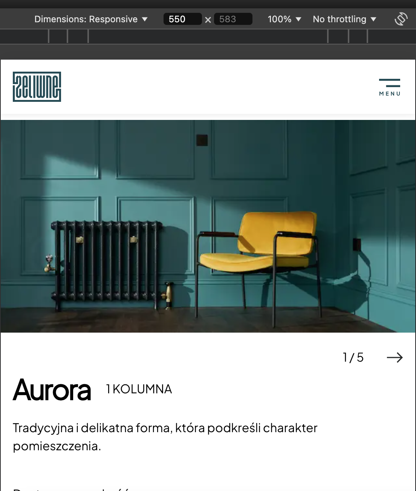
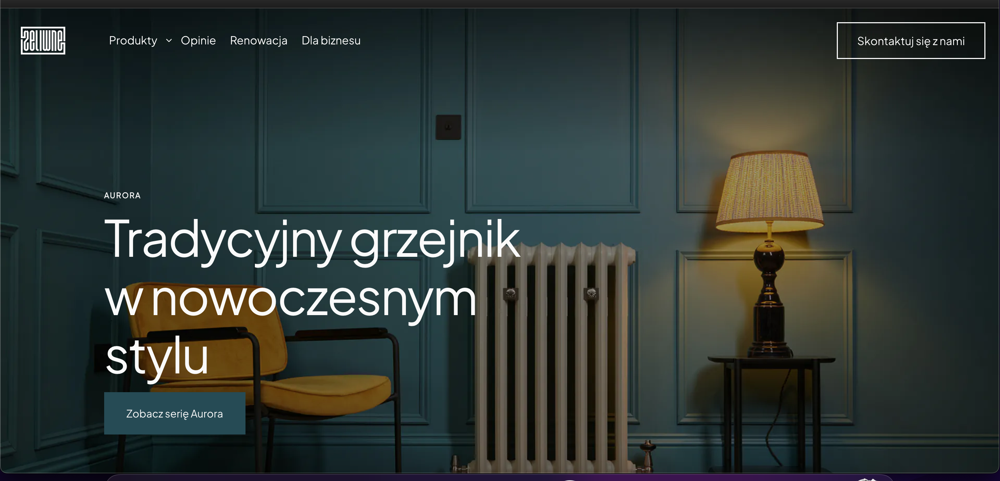
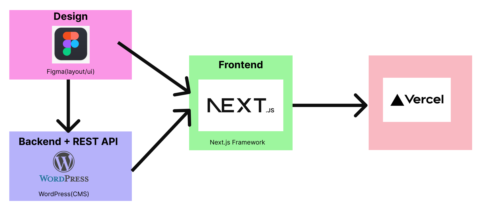

# Zeliwne
## Ekrany aplikacji/ Screens for Appliacation





## Opis projektu / Project Description

### [POL]
Zeliwne jest to projekt aplikacji internetowej, gdzie frontend został wykonany we frameworku Next.js, a za backend z bazą danych odpowiada WordPress. Klient w panelu administracyjnym WordPressa może modyfikować i wprowadzać dowolne zmiany tekstu i grafik. Struktura graficzna projektu po konsultacjach z klientem została wykonana w Figmie. Docelowo projekt został udostępniony na Vercelu.

### [ENG]
Zeliwne is a web application project where the frontend is built using the Next.js framework, and the backend, along with the database, is powered by WordPress. The client can use the WordPress admin panel to modify and make any changes to the text and graphics. The graphical structure of the project, developed after consultations with the client, was designed in Figma. Ultimately, the project was deployed on Vercel.



## Wymagania wstępne / Prerequisites

- **Node.js**: 18.17.0 (Zalecana: 22)  
- **Git**: Wersja >2  
- **Edytor kodu**: np. Visual Studio Code  

- **Node.js**: 18.17.0 (Recommended: 22)  
- **Git**: Version >2  
- **Code editor**: e.g. Visual Studio Code  


### Instalacja / Installation

1. Sklonuj repozytorium:  
   ```bash  
   git clone https://github.com/takimi12/Final-Zelwine  
   ```  
2. Zainstaluj zależności:  
   ```bash  
   npm install  
   ```  
3. Uruchom aplikację w trybie deweloperskim:  
   ```bash  
   npm run dev  
   ```  

1. Clone the repository:  
```bash  
git clone https://github.com/takimi12/Final-Zelwine  
```  
2. Install dependencies:  
```bash  
npm install  
```  
3. Run the app in development mode:  
```bash  
npm run dev  
```  

---

## Skrypty / Scripts

### dev: `next dev`  
- Uruchamia aplikację w trybie deweloperskim.  
- Funkcje:
  - Serwer deweloperski.
  - Automatyczne odświeżanie strony po zmianach w kodzie.
  - Idealny do aktywnego rozwijania projektu.

### build: `next build`  
- Kompiluje aplikację do wersji produkcyjnej.  
- Funkcje:
  - Optymalizacja kodu (np. redukcja rozmiaru, minifikacja).
  - Generowanie statycznych plików HTML i innych zasobów.
  - Przygotowanie do wdrożenia na serwer produkcyjny.

### start: `next start`  
- Uruchamia aplikację w trybie produkcyjnym przy użyciu wcześniej skompilowanej wersji.  
- Używany po wdrożeniu aplikacji na serwerze produkcyjnym.

### lint: `next lint`  
- Sprawdza kod za pomocą narzędzia ESLint w celu wykrycia i naprawy potencjalnych błędów.  
- Funkcje:
  - Analiza zgodności ze standardami kodowania.

### format: `prettier --write .`  
- Formatuje kod przy użyciu narzędzia Prettier.  
- Funkcje:
  - Zachowanie spójnego stylu kodowania w projekcie.

### dev: `next dev`  
- Runs the application in development mode.  
- Features:
  - Development server.
  - Automatic page refresh after code changes.
  - Ideal for active project development.

### build: `next build`  
- Compiles the application to a production version.  
- Features:
  - Code optimization (e.g. size reduction, minification).
  - Generating static HTML files and other resources.
  - Preparing for deployment to a production server.

### start: `next start`  
- Runs the application in production mode using a previously compiled version.  
- Used after deploying the application to a production server.

### lint: `next lint`  
- Checks the code using the ESLint tool to detect and fix potential errors.  
- Features:
  - Analysis of coding standards compliance.

### format: `prettier --write .`  
- Formats code using the Prettier tool.  
- Features:
  - Maintains a consistent coding style across your project.

## Link do wersji live / Live version link

Link do aplikacji zostanie podany po poprawieniu endpointów WordPressa i plików `.t`.  
The link to the application will be provided after correcting the WordPress endpoints and `.t` files.

## Architektura projektu / Project Architecture

### Backend  
- Backend został napisany w oparciu o WooCommerce.  
- Treści wyświetlane na stronie pochodzą z endpointów API WordPressa.

### Frontend  
- Architektura aplikacji Next.js odzwierciedla flow stworzone przez autora backendu, co zapewnia intuicyjność i szybkość obsługi pod kątem wprowadzania danych.

### Rozszerzalność  
- Struktura CMS WordPress została zaprojektowana tak, aby w przyszłości można było łatwo przekształcić aplikację w sklep internetowy.

### Backend  
- The backend was written based on WooCommerce.  
- The content displayed on the page comes from WordPress API endpoints.

### Frontend  
- The Next.js application architecture reflects the flow created by the backend author, which ensures intuitiveness and speed of use in terms of data entry.

### Extensibility  
- The WordPress CMS structure was designed so that in the future you can easily transform the application into an online store.

## Kontakt do autora / Author Contact

- GitHub: [takimi12](https://github.com/takimi12)  
- LinkedIn: [Tomasz Olech](https://www.linkedin.com/in/tomasz-olech-136b9a13a/)  
- E-mail: [tomek12olech@gmail.com](mailto:tomek12olech@gmail.com)  
